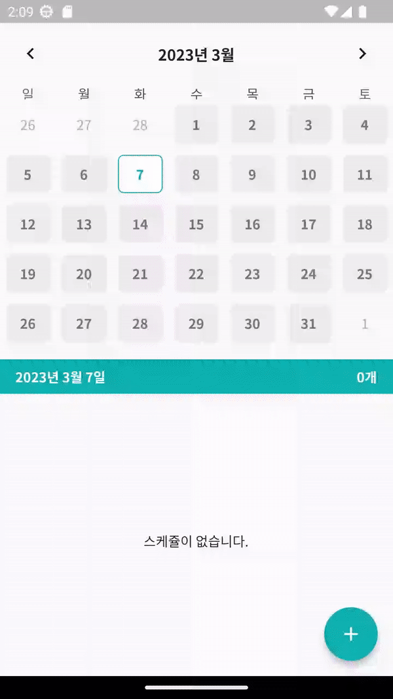

# Flutter를 사용한 캘린더 스케쥴러 프로젝트

# ✅ Topic

- SQLite ORM과 Drift를 사용한 스케쥴 저장
- GetIt 패키지를 통한 Dependency Injection

# 📝 Summary

- Next.js를 사용 한 경험은 있지만 SSR을 제대로 사용하지 않고 프로젝트를 진행 했던 점에서 Next.js의 장점인 SSR, SEO, 웹 성능 최적화 기능에 대한 학습을 진행하기 위한 토이 프로젝트 입니다.

# ⚙️ Tech Stack

```
Dart, Flutter, SQLite
```

# ✏️ Learned

- SQLite의 ORM을 이용한 간단한 SQL 다루기
- GetIt 패키지를 통한 의존성 주입으로 보다 쉬운 의존성 관리
- Form 사용을 통해 여러 텍스트필드를 편하게 관리
- CRUD 및 Flutter의 UI 학습

# 📷ScreenShot

### 캘린더 스케쥴러 시연



# ✨ TakeAway

Flutter에 대한 관심을 가지고 차근차근 따라해가며 만든 사이드 프로젝트이다. 비록 처음부터 기획해서 개발한 것은 아니지만, 배움의 목적으로 진행했던 프로젝트 였던 만큼 Flutter의 구조에 더 친숙해질 수 있었다.
처음 배운 개념인 Dependency Injection에 대해 알 수 있어 좋았고, 예전에 장고에서 사용해본 SQLite를 여기서 또 만나니 반가웠다.
계속 진행하다보니 플러터에서의 중앙상태관리에 대해 알고싶어졌고, 나중엔 그 쪽에 대해 중점적으로 공부를 진행해봐야겠다.
